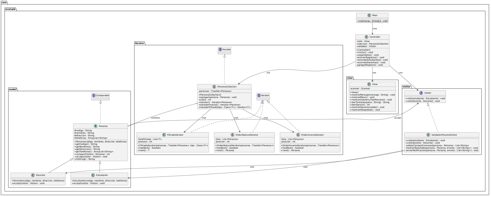

# Patrones de Diseno Iterator y Visitor

## Autor

**Nombre:** Josep Emanuel Leon Joya

**Codigo:** 20231020160
---

## Descripcion

Proyecto en Java que implementa los patrones de diseno GoF **Iterator** y **Visitor** aplicados a un dominio de personas (Estudiantes y Docentes). El sistema permite registrar, recorrer y validar datos mediante una arquitectura organizada en paquetes con separacion de responsabilidades.

## Reglas de Negocio

- Todos los campos de una persona (codigo, nombres, direccion, telefonos) deben estar completos.
- Si es **Docente**, el codigo debe tener un maximo de 4 caracteres.
- Si faltan datos, se simula el envio de una notificacion en consola.

## Estructura del Proyecto

```
demo/src/main/java/com/example/
├── Main.java
├── Controller.java
├── model/
│   ├── Persona.java          (clase abstracta)
│   ├── Estudiante.java       (subclase)
│   └── Docente.java          (subclase)
├── iterator/
│   ├── PersonaCollection.java      (coleccion con TreeSet)
│   ├── OrdenNaturalIterator.java   (recorrido ascendente)
│   ├── OrdenInversoIterator.java   (recorrido descendente)
│   └── FiltradoIterator.java       (recorrido filtrado por tipo)
├── visitor/
│   ├── Visitor.java                 (interfaz)
│   └── ValidadorPersonaVisitor.java (validacion concreta)
└── view/
    └── View.java                    (impresion por consola)
```

## Patrones Implementados

### Patron Iterator

Se utiliza una coleccion personalizada `PersonaCollection` que almacena objetos `Persona` en un `TreeSet` (ordenado por codigo). Se implementan tres iteradores concretos:

| Iterador | Descripcion |
|---|---|
| `OrdenNaturalIterator` | Recorre en orden ascendente por codigo |
| `OrdenInversoIterator` | Recorre en orden descendente por codigo |
| `FiltradoIterator<T>` | Recorre solo personas de un tipo especifico (Estudiante o Docente) |

### Patron Visitor

Se define la interfaz `Visitor` con metodos `visit(Estudiante)` y `visit(Docente)`. La clase `ValidadorPersonaVisitor` implementa la logica de validacion de datos y simula notificaciones cuando hay datos incompletos.

## Diagrama de Clases UML



## Menu de Opciones

Al ejecutar el programa se presenta el siguiente menu:

```
MENU DE OPCIONES
1. Recorrer registros
2. Recorrido solo Estudiantes
3. Recorrido solo Docentes
4. Agregar nuevo registro
5. Salir
```

La opcion 4 despliega un submenu para elegir el tipo de registro (Estudiante o Docente) y solicita los datos por consola.

## Tecnologias
- Maven
